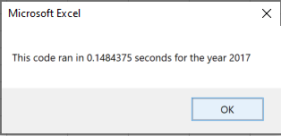

# Stock Analysis
Analyzing 2017 and 2018 Stock Datasets

## Overview of Project
The purpose of this project is to analyze the performance of twelve stocks in 2017 and 2018 to provide Steve and his parents with information so they can make a more informed decision where to invest their money. 

## Results

#### Stock Performance
In 2018, all of the stocks' returns performed worse than in 2017. DQ performed phenomenally in 2017 with a return of 199.4%, but had a return of -62.6% in 2018. Overall, the two stocks that performed the best were ENPH and RUN. Steve's parents should look more closely at those stocks to potentially invest in them.

#### Refactored Script
Refactoring the script majorly improved the run time of it. Both 2017 and 2018 had faster run times. Below are the run times of the refactored script for 2017 and 2018.

Refactoring the script also made it more clear to read for the developer. For example, the below refactored code is easier to understand:
            '3a) Increase volume for current ticker
            tickerVolumes(tickerIndex) = tickerVolumes(tickerIndex) + Cells(i, 8).Value
            
            '3b) Check if the current row is the first row with the selected tickerIndex.
            
             If Cells(i - 1, 1).Value <> tickers(tickerIndex) Then
             
                tickerStartingPrices(tickerIndex) = Cells(i, 6).Value
                
            End If
            
            '3c) check if the current row is the last row with the selected ticker
            'If the next row’s ticker doesn’t match, increase the tickerIndex.
            
            If Cells(i + 1, 1).Value <> tickers(tickerIndex) Then
            
                tickerEndingPrices(tickerIndex) = Cells(i, 6).Value
                
                '3d Increase the tickerIndex.
                tickerIndex = tickerIndex + 1
                
            End If

Below is the original code, which is clunky and unclear:
            '5a) Find the total volume for the current ticker
            If Cells(j, 1).Value = ticker Then

                totalVolume = totalVolume + Cells(j, 8).Value

            End If

            '5b) Find the starting price for the current ticker
            If Cells(j - 1, 1).Value <> ticker And Cells(j, 1).Value = ticker Then
            
                startingPrice = Cells(j, 6).Value

            End If

            '5c) Find the ending price for the current ticker
            If Cells(j + 1, 1).Value <> ticker And Cells(j, 1).Value = ticker Then

                endingPrice = Cells(j, 6).Value

As shown, the refactored code is condensed and clearer - saving time and energy trying to understand the original VBA script.

## Summary
Refactoring code has both advantages and disadvantages. One of the major pros of refactoring code is it helps the code run more effeciently. This is clearly seen in this analysis; after refactoring our code, the run time of the 2017 stock analysis went from 0.82 seconds to 0.15 seconds. Additionally, it helps with the readability of the code. It is much easier to follow and understand the refactored code. A major disadvantage of refactoring code is the amount of time it can take. For this project, I struggled to refactor this code in a timely manner. It was difficult to do and required a lot of research. However, I know that practice will help ease this disadvantage. 
